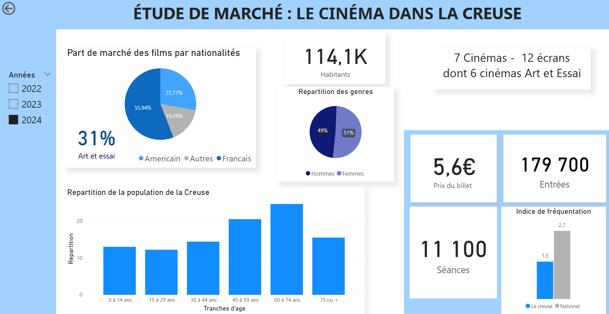
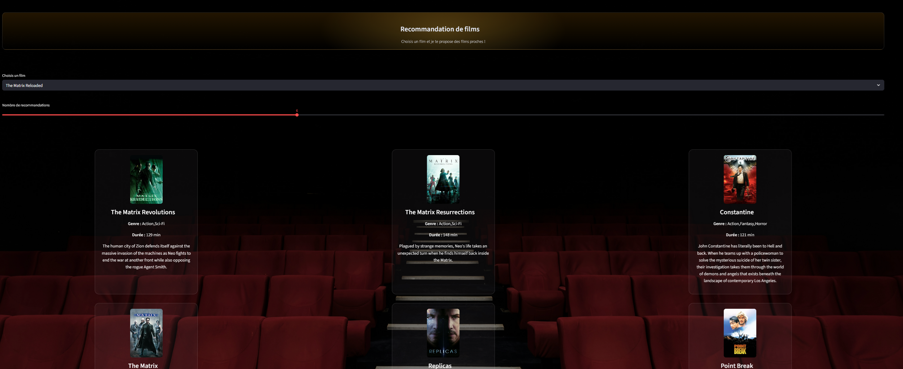

# 🎬 Cinema Recommendation System  
## Étude de Marché & Développement d’un Moteur de Recommandation  
**Client : Cinéma indépendant – Creuse (France)**

🔗 Code source : https://github.com/RomanGrdon/cinema-reco-app  
🌐 Démo en ligne : https://cinema-reco-app-y9tmapvt77u243lrzjztge.streamlit.app/

---

## 📌 Contexte

Dans le cadre de ma formation en Data & IA, j’ai travaillé sur une mission simulant un cas réel :

Un cinéma indépendant situé dans la Creuse, en perte de fréquentation, souhaite amorcer sa transition digitale en développant :

- 🌐 Un site internet dédié aux habitants locaux  
- 🎯 Un moteur de recommandation de films  
- 🔔 À terme : un système de notifications personnalisées  

Le principal défi est une situation de **cold start** : aucune donnée utilisateur n’est disponible.

Le cinéma met à disposition une base de données de films issue d’IMDb.

---

## 🎯 Objectifs du Projet

1️⃣ Réaliser une **étude de marché locale** afin de comprendre :
- Les habitudes de consommation cinéma dans la Creuse  
- Les préférences démographiques  
- L’offre concurrentielle  
- Le positionnement actuel du cinéma  

2️⃣ Analyser la base de données films pour identifier :
- Les acteurs les plus présents  
- Les périodes cinématographiques dominantes  
- L’évolution de la durée moyenne des films  
- La comparaison acteurs cinéma vs séries  
- Les films les mieux notés et leurs caractéristiques  

3️⃣ Développer un **moteur de recommandation** adapté au contexte local.

---

## 📊 1. Étude de Marché – Cinéma dans la Creuse

### Objectif

Avant de développer le moteur de recommandation, j’ai commencé par analyser le marché local afin d’identifier les attentes et le potentiel réel de fréquentation.

### Analyses réalisées

- Population totale et structure démographique  
- Répartition par tranches d’âge  
- Part de marché des films par nationalité  
- Indice de fréquentation comparé au niveau national  
- Nombre de cinémas et écrans disponibles  
- Prix moyen du billet  
- Volume annuel d’entrées  

📷 

### Insights clés

- Indice de fréquentation inférieur à la moyenne nationale  
- Population vieillissante → potentiel intérêt pour films patrimoniaux  
- Forte présence de cinéma Art & Essai  
- Opportunité de spécialisation thématique  

---

## 📊 2. Analyse Exploratoire de la Base IMDb

### Objectif

À partir de la base IMDb fournie, j’ai réalisé une analyse exploratoire approfondie afin d’identifier des axes stratégiques de programmation.

### Analyses réalisées

- Acteurs les plus représentés au cinéma  
- Comparaison présence cinéma vs séries  
- Évolution de la durée moyenne des films  
- Identification des films les mieux notés  
- Analyse des genres dominants  
- Étude des périodes les plus prolifiques (ex : années 90)

### Orientations stratégiques possibles

Sur la base de ces analyses, j’ai pu envisager :

- Une spécialisation sur les films des années 90  
- Une mise en avant des genres Action / Aventure  
- Une programmation centrée sur certains acteurs populaires  
- Une sélection prioritaire de films à forte note moyenne  

---

## 🤖 3. Développement du Moteur de Recommandation

### Problème : Cold Start

Aucune donnée utilisateur n’étant disponible, j’ai développé un système de recommandation basé sur la similarité entre films.

---

### 🧠 Méthodologie

#### 1️⃣ Préparation des données
- Nettoyage et normalisation  
- Sélection des features pertinentes  
- Vectorisation des caractéristiques films  

#### 2️⃣ Modélisation
- Implémentation de l’algorithme K-Nearest Neighbors  
- Calcul des distances pour identifier les films similaires  
- Optimisation du nombre de voisins  

#### 3️⃣ Déploiement
- Développement d’une application interactive avec Streamlit  
- Intégration du modèle ML  
- Personnalisation visuelle via **CSS intégré dans Streamlit**
- Déploiement en ligne  

---

## 🎨 Personnalisation UI

Afin d’améliorer l’expérience utilisateur et rendre l’interface plus professionnelle, j’ai intégré :

- Du **CSS personnalisé**
- Une amélioration de la hiérarchie visuelle
- Une adaptation des couleurs et des composants
- Une meilleure mise en valeur des recommandations

Cela permet de transformer un prototype technique en application plus crédible côté utilisateur.

---

## 🚀 Fonctionnement de l’Application

1. L’utilisateur sélectionne un film  
2. Le modèle calcule les films les plus proches  
3. L’application affiche instantanément les recommandations  

📷 

---

## 🛠 Stack Technique

- Python  
- Pandas  
- Scikit-learn  
- Streamlit  
- CSS (personnalisation interface)  
- K-Nearest Neighbors  
- Analyse exploratoire de données  

---

## 📈 Valeur Business

À travers ce projet, je démontre :

- Ma capacité à partir d’un besoin client concret  
- Une approche orientée décision et stratégie  
- La gestion d’un contexte cold start  
- La transformation d’une analyse data en application exploitable  
- Une compréhension des enjeux économiques locaux  
- La capacité à améliorer l’expérience utilisateur via personnalisation UI  

---

## 🔮 Perspectives d’Amélioration

- Implémentation d’un système hybride (contenu + collaboratif)  
- Évaluation formelle du modèle (precision@k, recall@k)  
- Développement d’une API REST pour intégration au site web  
- Mise en place de notifications personnalisées  
- Estimation chiffrée de l’impact potentiel sur la fréquentation  

---

## 📁 Structure du Projet

cinema-reco-app/
│
├── app.py
├── requirements.txt
├── data/
├── model/
├── notebooks/
├── dashboard/
└── README.md

---

## 👤 Auteur

Roman Gourdon  
Data Analyst | SQL • Python • Power BI  
GitHub : https://github.com/RomanGrdon  